# 8086-Assembly Problems

This repository contains all the **x86 assembly** code problems I completed in my microprocessor course.
The code has comments that explain the thought process behind each solution.

However if you have any questions, email me: emon331@gmail.com

## List of problems
*These coincide with the file naming*

### 1. Invert an array without using a loop
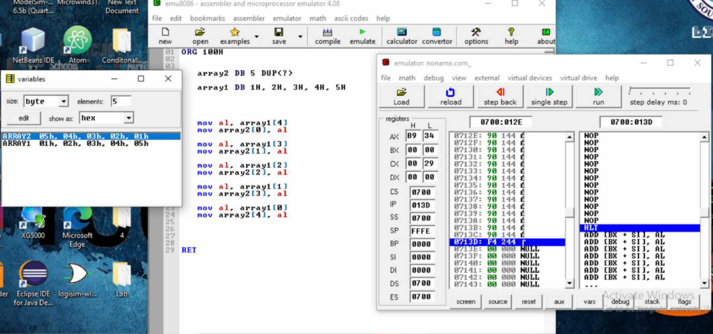
### 2. Demonstrating of calling a procedure
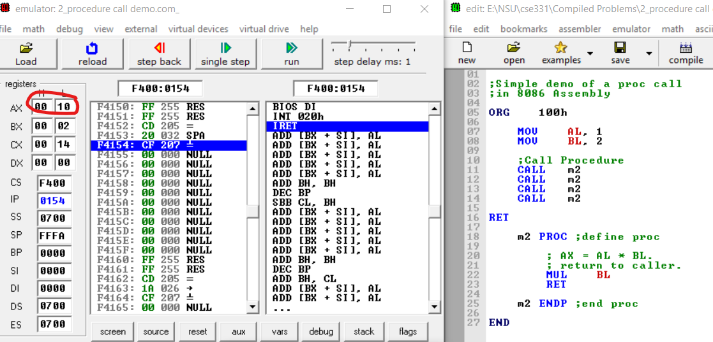
### 3. Demostrating JMP function
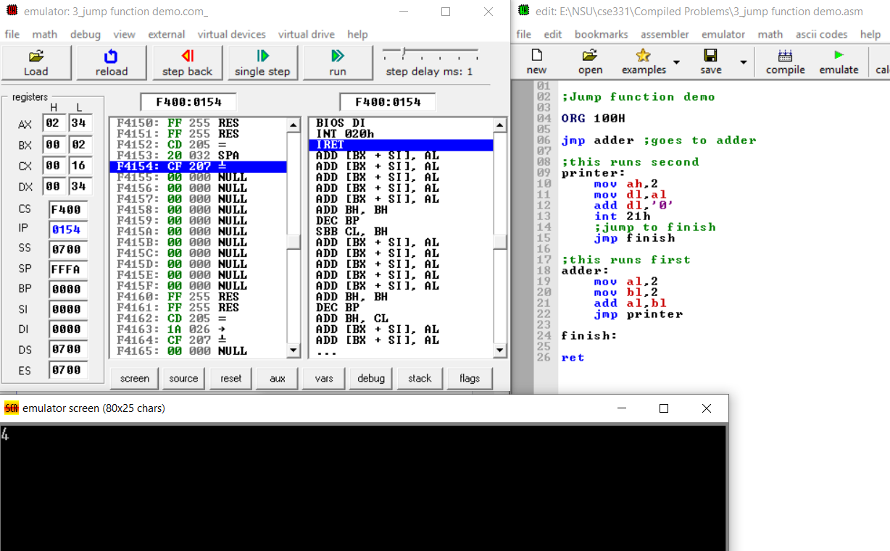
### 4. Counting number of char in a string
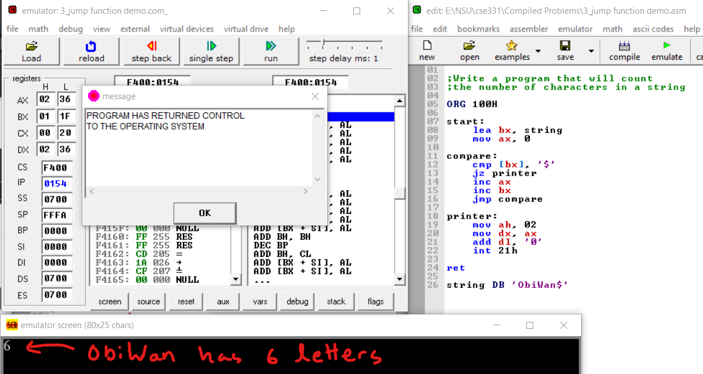
### 5. Calculating the factorial of a number
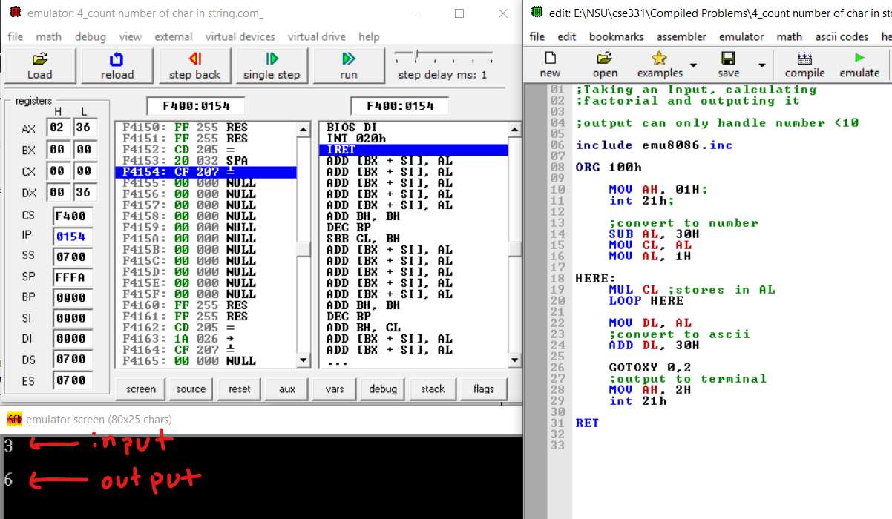
### 6. Printing out a pre-defined string
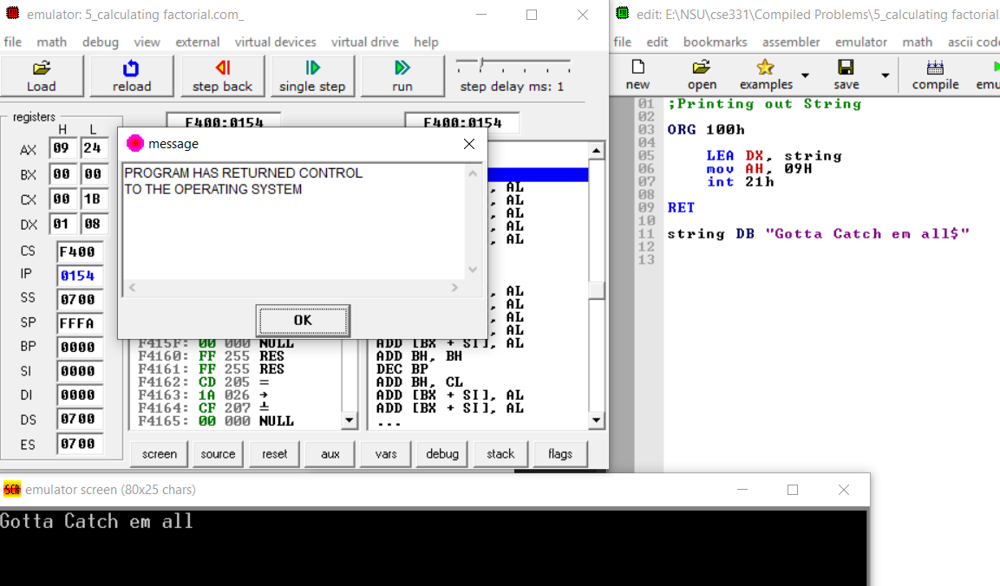
### 7. Reversing a string
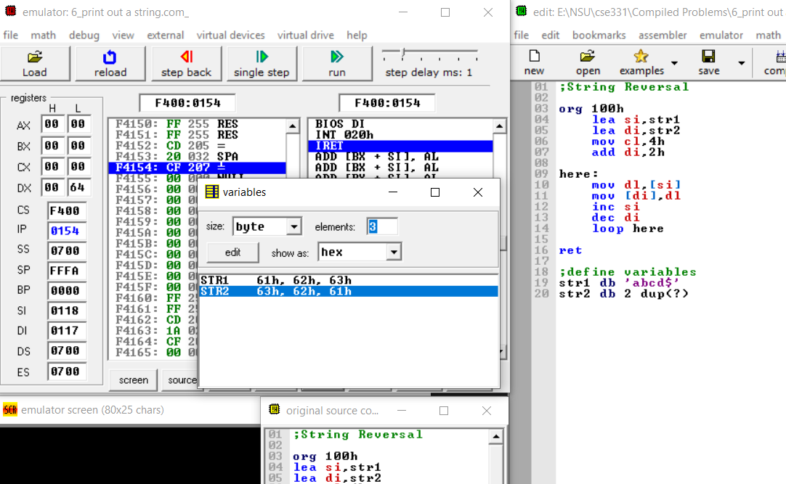
### 8. Finding sum of an array of numbers
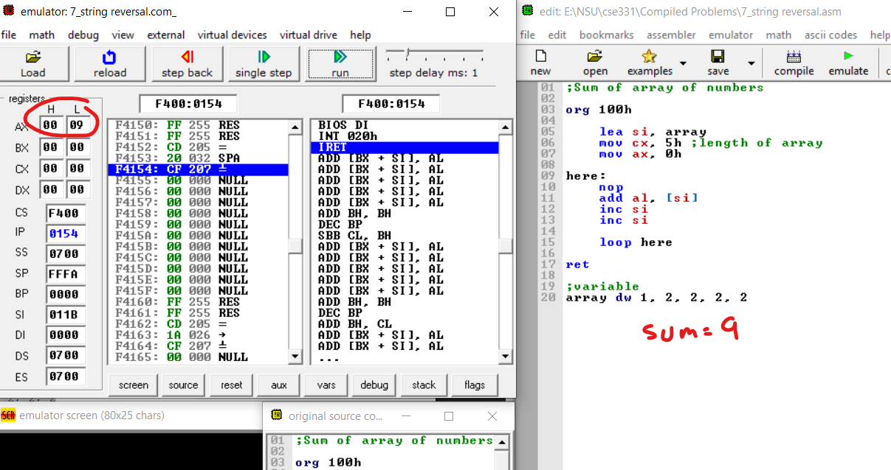
### 9. Counting number of a specific char in string
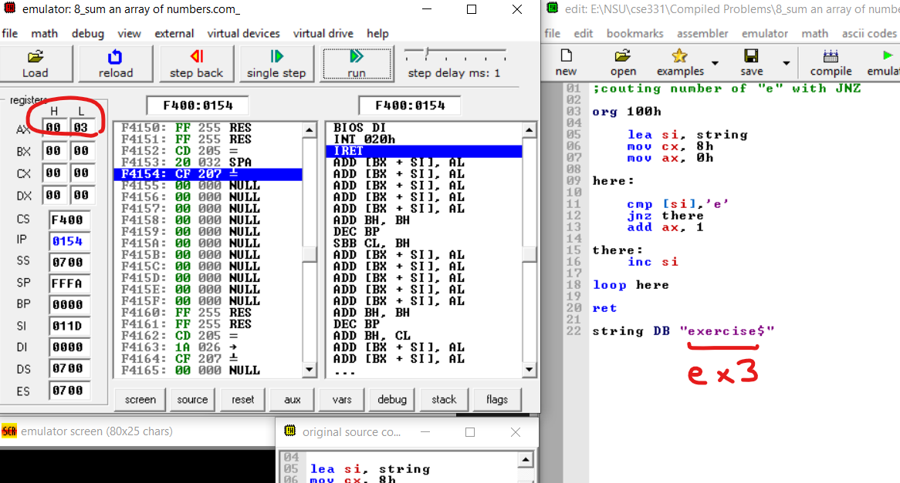
### 10. String concatanation
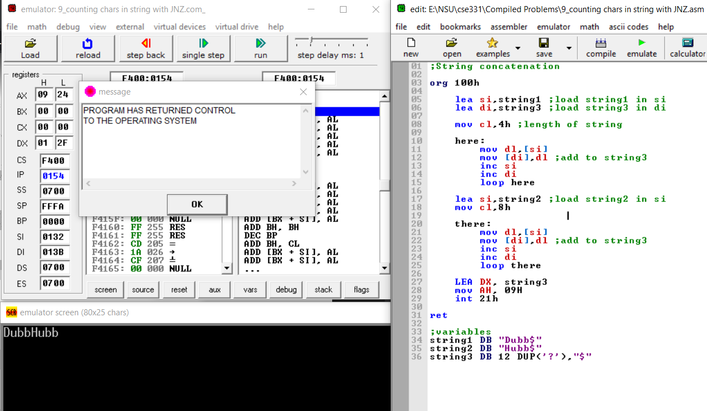
### 11. Finding length of a string
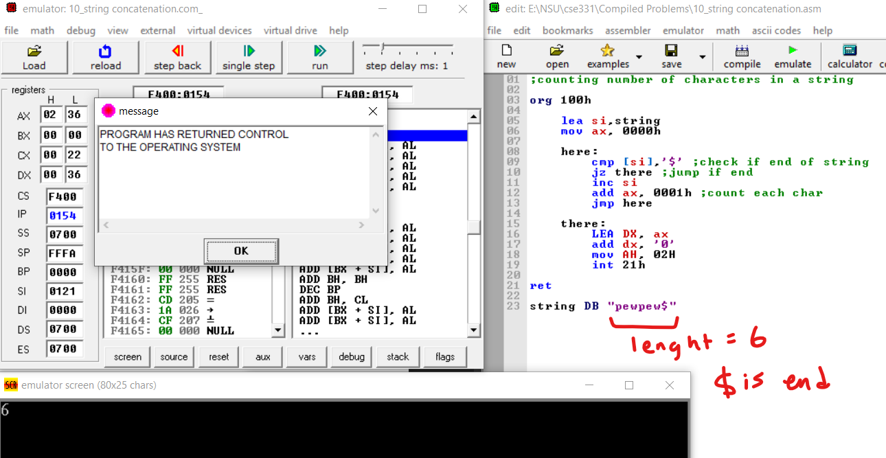
