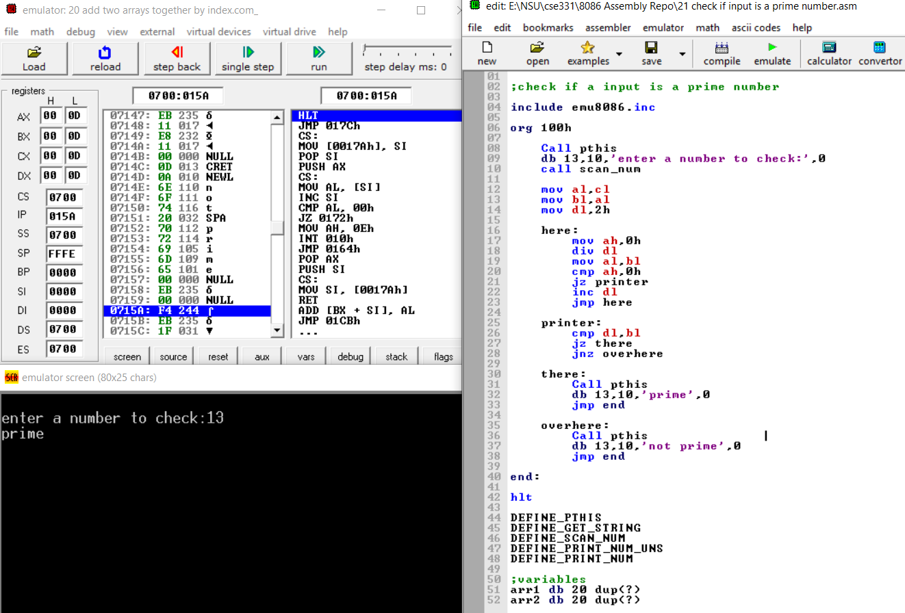

# 22 8086 Assembly Problems & Solutions
## Link to repo: [https://github.com/emondsarker/8086-Assembly](https://github.com/emondsarker/8086-Assembly)
By: Emon Sarker

This repository contains all the **x86 assembly** code problems I completed in my microprocessor course (CSE331).
The code has comments that explain the thought process behind each solution.

However if you have any questions, email me: emon331@gmail.com

## List of problems

Table of Content
1. [Invert an array without using a loop](#1-invert-an-array-without-using-a-loop)
2. [Demonstrating of calling a procedure](#2-demonstrating-of-calling-a-procedure)
3. [Demostrating JMP function](#3-demostrating-jmp-function)
4. [Counting number of char in a string](#4-counting-number-of-char-in-a-string)
5. [Calculating the factorial of a number](#5-calculating-the-factorial-of-a-number)
6. [Printing out a pre-defined string](#6-printing-out-a-pre-defined-string)
7. [Reversing a string](#7-reversing-a-string)
8. [Finding sum of an array of numbers](#8-finding-sum-of-an-array-of-numbers)
9. [Counting number of a specific char in string](#9-counting-number-of-a-specific-char-in-string)
10. [String concatanation](#10-string-concatanation)
11. [Finding length of a string](#11-finding-length-of-a-string)
12. [Reverse a string](#12-reverse-a-string)
13. [Shift right using SHR dynamically](#13-shift-right-using-shr-dynamically)
14. [Shift left using SHL dynamically](#14-shift-left-using-shl-dynamically)
15. [Check if input strings are equal](#15-check-if-input-strings-are-equal)
16. [String reversal using Stack](#16-string-reversal-using-stack)
17. [Find index of char in a string](#17-find-index-of-char-in-a-string)
18. [Take 16bit input and convert to decimal](#18-take-16bit-input-and-convert-to-decimal)
19. [Print largest value in an array input](#19-print-largest-value-in-an-array-input)
20. [Add two arrays together by index](#20-add-two-arrays-together-by-index)
21. [Check if input is a prime number](#21-check-if-input-is-a-prime-number)
22. [Lexicography question](#22-lexicography-question)

---
### 1. Invert an array without using loop

Declare an array variable with 5 random values. Declare a second array in which you store the values of the first array but inverted

Link to [solution](https://github.com/emondsarker/8086-Assembly/blob/main/01%20invert%20an%20array%20without%20loop.asm)

``` 
ORG 100H
    
    ;use register al to swap
    
    mov al, array[4]
    mov array2[0], al
    
    mov al, array[3]
    mov array2[1], al
    
    mov al, array[2]
    mov array2[2], al
    
    mov al, array[1]
    mov array2[3], al
    
    mov al, array[0]
    mov array2[4], al

RET

;variables

array1 DB 1H, 2H, 3H, 4H, 5H
array2 DB 5 DUP(?)
```
**Screenshot:**


---
### 2. Demonstrating of calling a procedure

Define a procedure PROC named m2 and CALL it 4 times

Link to [solution](https://github.com/emondsarker/8086-Assembly/blob/main/02%20procedure%20call%20demo.asm)

```
ORG    100h 
 
    MOV    AL, 1 
    MOV    BL, 2 
    
    ;Call Procedure 
    CALL   m2 
    CALL   m2 
    CALL   m2 
    CALL   m2 
 
RET                    
 
    m2 PROC ;define proc
        
        ; AX = AL * BL.
        ; return to caller. 
        MUL    BL              
        RET
                            
    m2 ENDP ;end proc 
 
END 
```

**Screenshot:**


---
### 3. Demostrating JMP function

Use the jump (JMP) function to skip over a line of code

Link to [solution](https://github.com/emondsarker/8086-Assembly/blob/main/03%20jump%20function%20demo.asm)

```
ORG 100H  
 
jmp adder ;goes to adder  

;this runs second 
printer: 
    mov ah,2 
    mov dl,al 
    add dl,'0' 
    int 21h
    ;jump to finish 
    jmp finish 
 
;this runs first 
adder: 
    mov al,2 
    mov bl,2 
    add al,bl 
    jmp printer 
 
finish: 
 
ret  
```

**Screenshot:**


---
### 4. Counting number of char in a string

Define a string variable and initialize it with any string value.
Afterwards count the number of characters in the string and output the value

Link to [solution](https://github.com/emondsarker/8086-Assembly/blob/main/04%20count%20number%20of%20char%20in%20string.asm)

```
ORG 100H

start:
    lea bx, string
    mov ax, 0
    
compare:
    cmp [bx], '$'
    jz printer
    inc ax
    inc bx
    jmp compare
    
printer:
    mov ah, 02
    mov dx, ax
    add dl, '0'
    int 21h
    
ret

string DB 'ObiWan$' 
```

**Screenshot:**


---
### 5. Calculating the factorial of a number

Take input from the user using the interrupt function (int 21h) and calculate the factorial.
Print out the factorial on the console.

Link to [solution](https://github.com/emondsarker/8086-Assembly/blob/main/05%20calculating%20factorial.asm)

```
include emu8086.inc

ORG 100h

    MOV AH, 01H;
    int 21h;
    
    ;convert to number
    SUB AL, 30H        
    MOV CL, AL
    MOV AL, 1H

HERE:
    MUL CL ;stores in AL
    LOOP HERE
    
    MOV DL, AL
    ;convert to ascii
    ADD DL, 30H
    
    GOTOXY 0,2
    ;output to terminal
    MOV AH, 2H
    int 21h

RET
```

**Screenshot:**


---
### 6. Printing out a pre-defined string

Define and intialize a string variable.
Then output the string using the interrupt function (int 21h).

Link to [solution](https://github.com/emondsarker/8086-Assembly/blob/main/06%20print%20out%20a%20string.asm)

```
ORG 100h
    
    LEA DX, string
    mov AH, 09H
    int 21h

RET   

string DB "Gotta Catch em all$"
```

**Screenshot:**


---
### 7. Reversing a string

Define 2 arrays. In one array store a string.
Reverse that string and store it into the second array.

Link to [solution](https://github.com/emondsarker/8086-Assembly/blob/main/07%20string%20reversal.asm)

```
org 100h 
    lea si,str1
    lea di,str2
    mov cl,4h 
    add di,2h

here: 
    mov dl,[si]
    mov [di],dl 
    inc si
    dec di
    loop here

ret

;define variables
str1 db 'abcd$' 
str2 db 2 dup(?)
```

**Screenshot:**


---
### 8. Finding sum of an array of numbers

Define and initialize an array of integers.
Sum up the contents of the array and store it in the AL register.

Link to [solution](https://github.com/emondsarker/8086-Assembly/blob/main/08%20sum%20an%20array%20of%20numbers.asm)

```
org 100h 

    lea si, array
    mov cx, 5h ;length of array
    mov ax, 0h

here: 
    nop
    add al, [si]
    inc si
    inc si
    
    loop here

ret 

;variable
array dw 1, 2, 2, 2, 2
```

**Screenshot:**


---
### 9. Counting number of a specific char in string

Define and intialize a string, "exercise".
Write a program to count the number of "e" in "exercise"

Link to [solution](https://github.com/emondsarker/8086-Assembly/blob/main/09%20counting%20specific%20chars%20in%20string%20with%20JNZ.asm)

```
org 100h 

    lea si, string
    mov cx, 8h
    mov ax, 0h

here: 

    cmp [si],'e'
    jnz there
    add ax, 1

there:
    inc si

loop here

ret 

string DB "exercise$"
```

**Screenshot:**


---
### 10. String concatanation

Define and initialize 2 strings. Concatenate the strings and store it into a new array.
Print out the contents of the new array (which has the concatenated string) to the console.

Link to [solution](https://github.com/emondsarker/8086-Assembly/blob/main/10%20string%20concatenation.asm)

```
org 100h
 
    lea si,string1 ;load string1 in si
    lea di,string3 ;load string3 in di
    
    mov cl,4h ;length of string 
    
    here: 
        mov dl,[si]
        mov [di],dl ;add to string3 
        inc si
        inc di
        loop here
             
    lea si,string2 ;load string2 in si         
    mov cl,8h 
    
    there: 
        mov dl,[si]
        mov [di],dl ;add to string3 
        inc si
        inc di
        loop there 
    
    LEA DX, string3
    mov AH, 09H
    int 21h

ret
 
;variables
string1 DB "Dubb$" 
string2 DB "Hubb$"
string3 DB 12 DUP('?'),"$"
```

**Screenshot:**


---
### 11. Finding length of a string

Define and initialize a string. Write a program to calculate the length of the string
and print the length to the console.

Link to [solution](https://github.com/emondsarker/8086-Assembly/blob/main/11%20length%20of%20string.asm)

```
org 100h
 
    lea si,string
    mov ax, 0000h
    
    here: 
        cmp [si],'$' ;check if end of string
        jz there ;jump if end 
        inc si
        add ax, 0001h ;count each char
        jmp here         
    
    there:
        LEA DX, ax
        add dx, '0'
        mov AH, 02H
        int 21h

ret
 
string DB "pewpew$"
```

**Screenshot:**


---
### 12. Reverse a string

Take a user inputted string and use the stack to reverse it.
If an empty string is entered, print out a message saying that has occured.

Link to [solution](https://github.com/emondsarker/8086-Assembly/blob/main/12%20reverse%20a%20string.asm)

```
include emu8086.inc

ORG 100

    here:
         mov ah, 01h
         inc cl
         int 21h
         mov ah, 00h
         push ax
         cmp al, 13
         jz out1
         
    jmp here
    
    mov bl, cl
    
    out1:
    
        ;compare if string is 0
        cmp cl, 01h
        jnz out2
        CALL PTHIS
        db 13, 10, 'Empty String Entered', 0
        jmp exit
    
    out2:
    GOTOXY 0,2
    
    
    there:
         pop dx
         mov ah, 02h
         int 21h
         
    LOOP there
    
    exit:
hlt

DEFINE_PTHIS
```

**Screenshot:**


---
### 13. Shift right using SHR dynamically

Take an input for an integer. Then take an input for the magnitude of shift.
Shift the integer by the magnitude to the right.

Link to [solution](https://github.com/emondsarker/8086-Assembly/blob/main/13%20shift%20right%20using%20SHR%20dynamically.asm)

```
include emu8086.inc 

org 100h
    
    ;take input
    call pthis
    db 13,10, 'Enter no: ',0
    call scan_num  
    
    mov ax,cx
    
    ;take input for shift right
    call pthis
    db 13,10, 'shift by?:  ',0
    call scan_num  
    
    shr ax,cl ;shift right
    
    
    call pthis
    db 13,10, 'answer:  ',0  
    
    call print_num_uns

ret 

DEFINE_PTHIS
DEFINE_SCAN_NUM
DEFINE_PRINT_NUM_UNS 
```

**Screenshot:**


---
### 14. Shift left using SHL dynamically

Take an input for an integer. Then take an input for the magnitude of shift.
Shift the integer by the magnitude to the left.

Link to [solution](https://github.com/emondsarker/8086-Assembly/blob/main/14%20shift%20left%20using%20SHL%20dynamically.asm)

```
include emu8086.inc 

org 100h
    
    ;take input
    call pthis
    db 13,10, 'Enter no: ',0
    call scan_num  
    
    mov ax,cx
    
    ;take input for shift magnitude
    call pthis
    db 13,10, 'shift by?:  ',0
    call scan_num  
    
    shl ax,cl ;shift left
    
    
    call pthis
    db 13,10, 'answer:  ',0  
    
    call print_num_uns

ret 

DEFINE_PTHIS
DEFINE_SCAN_NUM
DEFINE_PRINT_NUM_UNS 
```

**Screenshot:**


---
### 15. Check if input strings are equal

Take in two user inputted strings.
Then write a program that compares the two strings to check if they are equal.

Link to [solution](https://github.com/emondsarker/8086-Assembly/blob/main/15%20check%20if%20input%20strings%20are%20equal.asm)

```
include 'emu8086.inc'

ORG    100h

    LEA    SI, msg1        
                         
    CALL   print_string   
    
    LEA    DI, buffer     
    MOV    DX, bufSize    
    CALL   get_string      
    
    lea si,buffer   
    
    GOTOXY 0,1
    LEA    SI, msg2       
     
                         
    CALL   print_string   
    
    LEA    DI, buffer2     
    MOV    DX, bufSize2    
    CALL   get_string       
    
    lea di,buffer2  
    
    
    lea si,buffer 
    mov cx,0
    
    countno:     
        inc cx 
        mov ax,[si]
        inc si
        cmp ax,0h;  
        
        jnz countno   
          
    lea di,buffer2       
    mov bx,0
    
    countno2:     
        inc bx 
        mov ax,[di]
        inc di
        cmp ax,0h
          
        jnz countno2 
    
    dec cx
    
    lea di,buffer2  
       
    lea si,buffer 
    
    loopin:  
        mov al,[di]  
        mov bl,[si]
        cmp  bl,al
        jc printl
        cmp al,bl
        jc printlp
        
        jz loop1      
        jnz printno 
        
    loop1:
        inc si
        inc di
        loop loopin
        
        jmp printyes
    
    printno:             
        call pthis 
        DB 13, 10
        db "Not the same", 0  
        
        jmp done  
          
    printyes:
        call pthis
        DB 13, 10
        db "They are the same", 0 
        
        jmp done
    
    
    printl:  
        lea si,buffer2      
        GOTOXY 0,3
        CALL   print_string 
        jmp done 
                      
    
    
    printlp:  
      
        lea si,buffer  
        GOTOXY 0,3
        CALL   print_string  
                  


done:

RET                                

; data
msg1   DB "Enter string: ", 0  
msg2   DB "Enter string2: ", 0  
buffer DB 20 DUP (0)      
buffer2 DB 20 DUP (0)  

 
bufSize = $-buffer    
 
bufSize2 = $-buffer2 
DEFINE_GET_STRING    
DEFINE_PTHIS
DEFINE_PRINT_STRING
END
```

**Screenshot:**


---
### 16. String reversal using Stack

Take a user inputted string and reverse it using the stack.

Link to [solution](https://github.com/emondsarker/8086-Assembly/blob/main/16%20reverse%20a%20string%20with%20stack.asm)

```
include emu8086.inc

ORG 100

    CALL PTHIS
    db 13, 10, 'Enter a String: ', 0
                             
    here:
        mov ah, 01h
        inc cl
        int 21h
        mov ah, 00h
        push ax
        cmp al, 13
        jz out1
       
        jmp here
    
        mov bl, cl
    
    out1:
    
        ;compare if string is 0
        
        cmp cl, 01h
        jnz out2
        
        CALL PTHIS
        db 13, 10, 'Emptry String Entered: ', 0
        jmp exit
    
    out2:
    
        CALL PTHIS
        db 13, 10, 'Reversed String: ', 0
        
        GOTOXY 0,4
    
    there:
        pop dx
        mov ah, 02h
        int 21h
       
    LOOP there
    
    exit:
   
hlt

DEFINE_PTHIS
```

**Screenshot:**


---
### 17. Find index of char in a string

Write a program that will take an input of a string and a character.
Then it will find the indexes where the character appears on the string.

String: "example"

Character: "e"

Output: 0, 6

Link to [solution](https://github.com/emondsarker/8086-Assembly/blob/main/17%20find%20index%20of%20chars%20in%20a%20string%20input.asm)

```
include emu8086.inc

ORG 100

    CALL PTHIS
    db 13, 10, 'enter a string: ',0
    
    mov dx, 10
    CALL GET_STRING
    
    CALL PTHIS
    db 13, 10, 'enter a char: ',0
    mov ah, 01h
    int 21h
    
    mov bl, al ;store char in bl
    mov bh, 0
    
    CALL PTHIS
    db 13, 10, 'index of instances: ',0
    
    here:                          
        mov dl, [di]
        inc di
        inc bh  
        
        cmp bl, dl
        jz there
        
        cmp dl, 0
        jz over
        jmp here
    
    
    there:
    
        mov dl, bh
        sub dl, 1
        add dl, 30h
        mov ah, 02
        int 21h
        mov dl, 44
        int 21h
        
        jmp here
    
    over:
     


hlt
   
DEFINE_GET_STRING
DEFINE_PTHIS 
```

**Screenshot:**


---
### 18. Take 16bit input and convert to decimal

Write a program that takes in a 16 bit input and converts that 16 bit value to decimal

Link to [solution](https://github.com/emondsarker/8086-Assembly/blob/main/18%20taking%2016bit%20input%20and%20converting%20it%20to%20decimal.asm)

```
include emu8086.inc

ORG 100h

    CALL PTHIS
    db 13, 10, 'enter a string: ',0
    mov dx, 17
    CALL GET_STRING
    
    
    mov cx, 16
    
    here:                          
        mov dl, [di]
        inc di  
        
        cmp dl, 31h
        jz there 
        
    continue:
    
        cmp dl, 0
        jz over        
        loop here
    
    
    there:
        mov bx, 1
        shl bx, cl
        add ax, bx
        
    
    jmp continue:
    
    over:
    
        CALL PTHIS
        db 13, 10, 'decimal: ',0
        
        sub ax, 1
        shr ax, 1
        
        
        CALL PRINT_NUM


DEFINE_PRINT_NUM
DEFINE_PRINT_NUM_UNS  
DEFINE_GET_STRING
DEFINE_PTHIS


end
```

**Screenshot:**


---
### 19. Print largest value in an array input

Write a program that takes in an array of input and then finds the maximum in that array then prints it out to the console.

Link to [solution](https://github.com/emondsarker/8086-Assembly/blob/main/19%20print%20largest%20value%20from%20array%20of%20inputs.asm)

```
include emu8086.inc

ORG 100h

    CALL PTHIS
    db 13, 10, 'enter an array of numbers to find max: ',0
    
    mov bl, 2
    
    here:
        CALL SCAN_NUM
        GOTOXY 0, bl
        inc bl
        cmp CX, 0
        jz end:
        
        cmp AX, CX
        jc cont
        jmp here
    
    cont:
        mov AX, CX
        jmp here
    
    
    end:
        CALL PTHIS
        db 13, 10, 'max: ',0
        CALL PRINT_NUM_UNS


DEFINE_SCAN_NUM
DEFINE_PRINT_NUM
DEFINE_PRINT_NUM_UNS  
DEFINE_GET_STRING
DEFINE_PTHIS


end
```

**Screenshot:**


---
### 20. Add two arrays together by index

Write a program that takes in 2 inputs of an array of 5 numbers.
Then add the two arrays and print out the values.

Array 1: 1, 2, 3, 4, 5

Array 2: 5, 4, 3, 2, 1

Output:  6, 6, 6, 6, 6


Link to [solution](https://github.com/emondsarker/8086-Assembly/blob/main/20%20add%20two%20arrays%20together%20by%20index.asm)

```
include emu8086.inc

ORG 100h

    CALL PTHIS
    db 13, 10, 'enter first 5 numbers: ',0
    
    mov bl, 6 ;size of array
    mov bh, 1
    lea si, array1
    
    loop1:
        dec bl
        inc bh
        GOTOXY 0, bh
        CALL SCAN_NUM
        mov [si], cx
        inc si
        mov cl, bl
        loop loop1
    
    
    CALL PTHIS
    db 13, 10, 'enter second 5 numbers: ',0
    
    mov bl, 6 ;size of array
    inc bh
    lea si, array2
    
    loop2:
        dec bl
        inc bh
        GOTOXY 0, bh
        CALL SCAN_NUM
        mov [si], cx
        inc si
        mov cl, bl
        loop loop2
    
    lea si, array1
    lea di, array2
    
    mov cl, 5
    
    inc bh
    GOTOXY 0, bh
    
    CALL PTHIS
    db 13, 10, 'array after add: ',0
    
    loop3:
        mov al, 00h
        add al, [si]
        add al, [di]
        inc si
        inc di
        
        mov ah, 00h
        CALL PRINT_NUM
        
        mov ah, 02h
        mov dl, 44
        int 21h
        mov dl, 32
        int 21h
        
        loop loop3


DEFINE_SCAN_NUM
DEFINE_PRINT_NUM
DEFINE_PRINT_NUM_UNS  
DEFINE_GET_STRING
DEFINE_PTHIS


hlt  

;variable

array1 db 0h,0h,0h,0h,0h
array2 db 0h,0h,0h,0h,0h
```

**Screenshot:**


---
### 21. Check if input is a prime number

Take in an integer from the user then write a program that will check if the number is a prime number or not.

Input: 13

Output: Prime

Input: 20

Output: Not prime

Link to [solution](https://github.com/emondsarker/8086-Assembly/blob/main/21%20check%20if%20input%20is%20a%20prime%20number.asm)

```
include emu8086.inc

org 100h

    Call pthis
    db 13,10,'enter a number to check:',0
    call scan_num
    
    mov al,cl
    mov bl,al
    mov dl,2h  
    
    here:
        mov ah,0h
        div dl
        mov al,bl
        cmp ah,0h
        jz printer
        inc dl
        jmp here
    
    printer:  
        cmp dl,bl
        jz there
        jnz overhere
    
    there:  
        Call pthis
        db 13,10,'prime',0
        jmp end
        
    overhere:  
        Call pthis
        db 13,10,'not prime',0
        jmp end

end:

hlt

DEFINE_PTHIS
DEFINE_GET_STRING
DEFINE_SCAN_NUM
DEFINE_PRINT_NUM_UNS  
DEFINE_PRINT_NUM

;variables  
arr1 db 20 dup(?)  
arr2 db 20 dup(?)
```

**Screenshot:**



---
### 22. Lexicography question

Take two strings as inputs from the user. Compare the two strings and determine if they are the 
same or not. If they are not, output the string which is lexicographically larger, else print “They 
are the same”. 

Link to [solution](https://github.com/emondsarker/8086-Assembly/blob/main/22%20lexicography%20question.asm)

```
include 'emu8086.inc'
ORG    100h

LEA    SI, msg1       ; set up pointer (SI) to msg
 
                     ; to ask for the number
CALL   print_string   ; print message that SI points to

LEA    DI, buffer     ; set up pointer (DI) to input buffer
MOV    DX, bufSize    ; set size of buffer
CALL   get_string     ; get name & put in buffer  

lea si,buffer   

GOTOXY 0,1
LEA    SI, msg2       ; set up pointer (SI) to msg
 
                     ; to ask for the number
CALL   print_string   ; print message that SI points to

LEA    DI, buffer2     ; set up pointer (DI) to input buffer
MOV    DX, bufSize2    ; set size of buffer
CALL   get_string     ; get name & put in buffer  

lea di,buffer2  


lea si,buffer 
mov cx,0
countno:     
inc cx 
mov ax,[si]
inc si
cmp ax,0h;  

jnz countno   
   
   
   
   
lea di,buffer2     
  
mov bx,0
countno2:     
inc bx 
mov ax,[di]
inc di
cmp ax,0h;  
jnz countno2 


 dec cx


lea di,buffer2  
   
lea si,buffer 
loopin:  

mov al,[di]  
mov bl,[si]
cmp  bl,al
jc printl
cmp al,bl
jc printlp
jz loop1 
 
jnz printno 
loop1:inc si
inc di
loop loopin
jmp printyes

printno:        
         
call pthis 
 DB 13, 10
  db "No", 0  
  jmp done  
  
  

  printyes:
call pthis
 DB 13, 10
  db "They are the same", 0 
  jmp done


  printl:  
  
    lea si,buffer2  
    
GOTOXY 0,3
    CALL   print_string 
    jmp done 
                  


    printlp:  
  
    lea si,buffer  
    
GOTOXY 0,3
    CALL   print_string  
                  


done:RET                                ; return to operating system.

; data
msg1   DB "Enter string: ", 0  
msg2   DB "Enter string2: ", 0  
buffer DB 20 DUP (0)  ; input buffer for get_string    
buffer2 DB 20 DUP (0)  ; input buffer for get_string

 
bufSize = $-buffer    ; calculates size of buffer
 
bufSize2 = $-buffer2 
DEFINE_GET_STRING    
DEFINE_PTHIS
DEFINE_PRINT_STRING
END
```

**Screenshot:**


